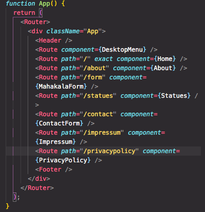

# Mahakala Art

## SPA Project made in React JS

To learn React, i rebuild art website.
Here i devide single elements (header, navigation, actual content, footer) and use components, props and JSON data for repeated elements.

[]

Now i'm working on backend (for API requests).
Soon also contact form will be ready.

## Tech Stack

- React JS
- CSS3
- JSX
- API requests (async/await)
- JSON data

## Topics

- using DNS (A-Record) for Domain on Strato
- deployment on Vercel for production
- Version Control on [GitHub](https://github.com/krisbaranski/mahakala-art)
- Database (images and JSON Data) on Supabase
- Single Page App with JSX 

## Credits

Big Thanks to [@DavidKuda](https://github.com/DavidKuda)